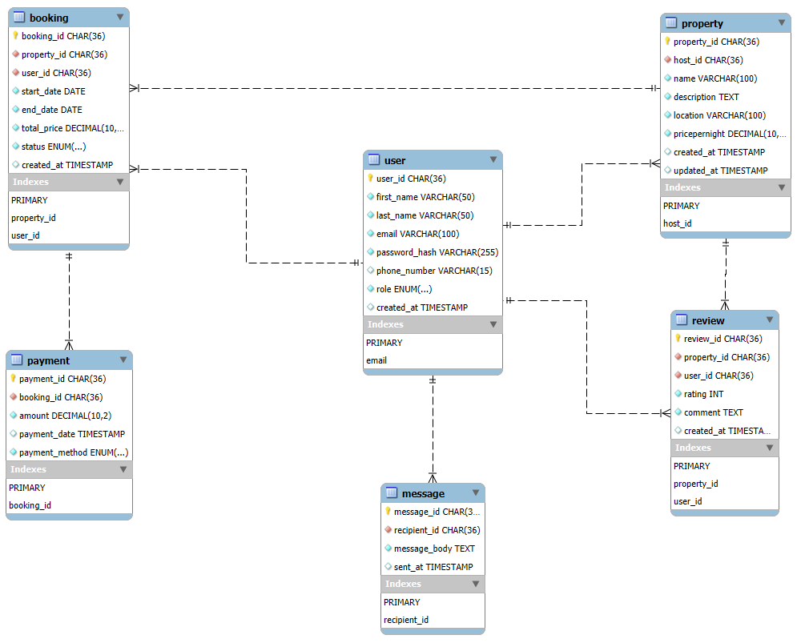

# Airbnb Database Entity-Relationship Diagram Documentation

## Entities and Attributes

### 1. User
- **user_id** (CHAR(36)) - Primary Key
- **first_name** (VARCHAR(50)) - NOT NULL
- **last_name** (VARCHAR(50)) - NOT NULL
- **email** (VARCHAR(100)) - UNIQUE, NOT NULL
- **password_hash** (VARCHAR(255)) - NOT NULL
- **phone_number** (VARCHAR(15)) - Optional
- **role** (ENUM('guest', 'host', 'admin')) - NOT NULL
- **created_at** (TIMESTAMP) - Default current timestamp

### 2. Property
- **property_id** (CHAR(36)) - Primary Key
- **host_id** (CHAR(36)) - Foreign Key to User
- **name** (VARCHAR(100)) - NOT NULL
- **description** (TEXT) - NOT NULL
- **location** (VARCHAR(100)) - NOT NULL
- **pricepernight** (DECIMAL(10,2)) - NOT NULL
- **created_at** (TIMESTAMP) - Default current timestamp
- **updated_at** (TIMESTAMP) - Updates automatically

### 3. Booking
- **booking_id** (CHAR(36)) - Primary Key
- **property_id** (CHAR(36)) - Foreign Key to Property
- **user_id** (CHAR(36)) - Foreign Key to User
- **start_date** (DATE) - NOT NULL
- **end_date** (DATE) - NOT NULL
- **total_price** (DECIMAL(10,2)) - NOT NULL
- **status** (ENUM('pending', 'confirmed', 'canceled')) - NOT NULL
- **created_at** (TIMESTAMP) - Default current timestamp

### 4. Payment
- **payment_id** (CHAR(36)) - Primary Key
- **booking_id** (CHAR(36)) - Foreign Key to Booking
- **amount** (DECIMAL(10,2)) - NOT NULL
- **payment_date** (TIMESTAMP) - Default current timestamp
- **payment_method** (ENUM('credit_card', 'paypal', 'stripe')) - NOT NULL

### 5. Review
- **review_id** (CHAR(36)) - Primary Key
- **property_id** (CHAR(36)) - Foreign Key to Property
- **user_id** (CHAR(36)) - Foreign Key to User
- **rating** (INT) - Value between 1-5, NOT NULL
- **comment** (TEXT) - NOT NULL
- **created_at** (TIMESTAMP) - Default current timestamp

### 6. Message
- **message_id** (CHAR(36)) - Primary Key
- **sender_id** (CHAR(36)) - Foreign Key to User
- **recipient_id** (CHAR(36)) - Foreign Key to User
- **message_body** (TEXT) - NOT NULL
- **sent_at** (TIMESTAMP) - Default current timestamp

## Relationships

1. **User → Property** (One-to-Many)
   - A user (host) can have multiple properties
   - Relationship: `host_id` in Property references `user_id` in User

2. **User → Booking** (One-to-Many)
   - A user (guest) can have multiple bookings
   - Relationship: `user_id` in Booking references `user_id` in User

3. **Property → Booking** (One-to-Many)
   - A property can have multiple bookings
   - Relationship: `property_id` in Booking references `property_id` in Property

4. **Booking → Payment** (One-to-One)
   - Each booking has exactly one payment
   - Relationship: `booking_id` in Payment references `booking_id` in Booking

5. **Property → Review** (One-to-Many)
   - A property can have multiple reviews
   - Relationship: `property_id` in Review references `property_id` in Property

6. **User → Review** (One-to-Many)
   - A user can write multiple reviews
   - Relationship: `user_id` in Review references `user_id` in User

7. **User → Message** (Many-to-Many)
   - Users can send and receive multiple messages
   - Relationships: 
     - `sender_id` in Message references `user_id` in User
     - `recipient_id` in Message references `user_id` in User

## ER Diagram

*Diagram created using MySQL Workbench, showing all entities, attributes, and relationships with proper cardinality notation.*